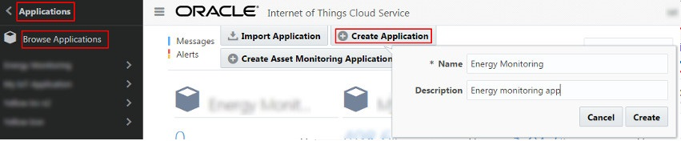

## Creating a New Application ##

We now have a device model for our RaspberryPi, but we still need an application to **_subscribe to the information_** our device will be sending. 

When you create a new IoT application, you need to associate it with at least one device model. In this case, your newly created RaspberryPi-model!

(To learn more, see [Understanding an IoT Application in Oracle IoT Cloud Service](https://docs.oracle.com/en/cloud/paas/iot-cloud/iotgs/understanding-iot-application-oracle-iot-cloud-service.html "Understanding an IoT Application in Oracle IoT Cloud Service").
Full official tutorial on how to create a new application can be found [here](https://docs.oracle.com/en/cloud/paas/iot-cloud/iotgs/creating-new-application.html "Creating a New Application"). )

## To create a new application:

1. From the Management Console Home page, click **Applications**, and then click **Browse Application**.
2. Click **Create Application**.
3. Enter your **Team name** and **Team slogan** as the application Name and Description.   

4. Click **Create**.  
   The new application is now added to the Applications Home page. **Double check** that you can find yours!
5. Click the IoT application’s name (your team's name) to continue defining the application’s elements.  
   The application’s dashboard is displayed. It is empty until you complete creating your application.
6. Click **Device Model** to associate the IoT application with your Device model from the previous step.  
  1. Click **Choose Device Model** and then pick the model you created in the previous step by checking the box in the Add column.
  2. Click **Done**
7. (Once device is configured) Click **Device Selection** to filter the devices that are allowed to send/recieve messages as part of the application.

### Already here? Time to [register your RaspberryPi as a trusted device](register.md)! ###
