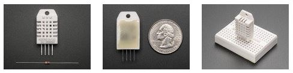
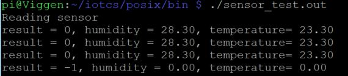

## Sharpen your senses and Test your sensor!##

For this client we are using an Adafruit sensor DHT22. This is a popular device that is reasonably accurate for a low price.

You can find some information on these devices [here](https://learn.adafruit.com/dht/overview#).
Due to availability we got DHT22's but for an easier ride you might want to go with the AM2302, which is a ready made version of the DHT22, with wires and everything.

Now we need to test that our sensor is actually working. To make this really simple we have provided a test client.

1. In the bin directory there is some code **sensor_test.c**. Compile this code with the provided shell script.
   `sh build_sensor_test.sh`

2. Then run the test with
   `./sensor_test.out`

If everything works you will get the current temperature and humidity.

3. You might notice that sometimes the sensor does not return any proper values. Since they are low cost this is ok. But we need to handle that in the client code. More on that later.

You have now successfully tested your DHT sensor! Time for the next step!

### [Building the IoT client](iotclient.md) ###
