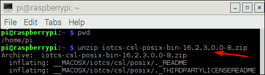

## Setup the Raspberry for IoT use! ##

We will revisit the different parts that are important if you would like to configure your own RPi, thus, **these steps have already been done on the provided Raspberries**.

The basic steps needed:

0. Setup WIFI connections. Instructions [here](https://www.raspberrypi.org/documentation/configuration/wireless/wireless-cli.md).

1. Creating a Bootable Image for the Raspberry. We are using the Raspbian Jessie Image.

2. Setting up the Raspberry to Allow SSH Connections

3. Connecting to the Raspberry
    1. Using SSH or Putty, **this is the option we are using**. We will post a list with the ip addresses for all the Raspberries to the Git repo at the start of the Meetup.
    2. Using a USB/TTY Cable

4. Optional. Setting the Raspberry Pi for a GUI Login. This is useful if you have an HDMI monitor and an external USB keyboard to use.

5. Optional. Setting a Static IP Address for the Raspberry. If you are on your own network and have control over address allocations.

6. Open the [Oracle IoT Cloud Service Client Software Library downloads page](http://www.oracle.com/technetwork/topics/cloud/downloads/iot-client-libraries-2705514.html).
7. Locate the Binary file for C POSIX Client Software Library and download the zip file to your RaspberryPi's home directory (/home/pi)
8. Enter the following **command**. If you're asked if you want to continue during the installation, answer Y.  
   `sudo apt-get install libssl-dev`  
     
9. Use the **unzip command** to extract the content of the iotcs-csl-posix-bin-release.zip file. The files are extracted into the subdirectory iotcs.  
     

The tool used for many of these steps is

`raspi-config`

The official setup instructions can be found [here](http://www.oracle.com/webfolder/technetwork/tutorials/obe/cloud/iot/RaspberryPiSetup/RaspberryPiSetup.html#section1).

On to some sensor work.

### [Sharpen your senses and Test your sensor](dhtsensor.md) ###
