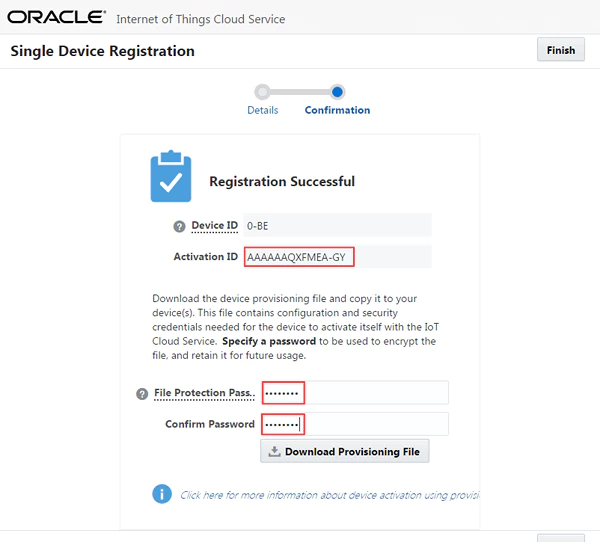

## Registering your RaspberryPi as a trusted Device ##

To communicate with IoT CS in a secure manner, every device that is connected to the Cloud Service must first be registered and then activated. 

(Full official tutorial can be found [here](https://docs.oracle.com/en/cloud/paas/iot-cloud/iotgs/registering-your-devices.html "Registering Your Devices"). )

### To register your RaspberryPi:

1. Open the Management Console. Click the **Menu** () , click **Devices**.
2. Click **Registration**.
3. Click **Register Single Device**.
4. Complete the mandatory and optional fields.
  * **Mandatory** - Activation ID: Please enter your **TeamName** using simple chars, ending with a number sequence. For example `Lavskrikan-404`
  * **Note:** Any additional information, such as Name, Description, and Model Number are optional, but can be useful as search criteria when managing your registered devices. If you leave the Activation Secret field blank, a value is auto-generated and displayed when the device registration is confirmed. You can enter your own Activation Secret value. 
  For the sake of this hackathon, enter som unique sequence with special meaning for your team in this field.
5. Click **Register**.
6. Specify a password in the File Protection Password and in Confirm Password fields to encrypt the provisioning file that contains the configuration and credentials to activate your device.  
  *Enter the password again in the **Confirm Password** field.  
   **_Note that password!_** You will need it and the downloaded file to connect your RaspberryPi to the IoT CS.  
   
7. Click **Download Provisioning File** to download the provisioning file to your computer.
The provisioning file is the shared secret with which it will identify itself to the IoT CS during activation to create trust.
8. Click **Finish**.
9. Click Management .
  * Double check that your RaspberryPi is listed in the Management pane with a State value of Registered and Type value of Unknown.

You have now successfully registered your RaspberryPi as a device in the IoT Cloud Service!

### Time for the next step: [Configure your RaspberryPi to connect to the IoT server](configure.md)! ###
